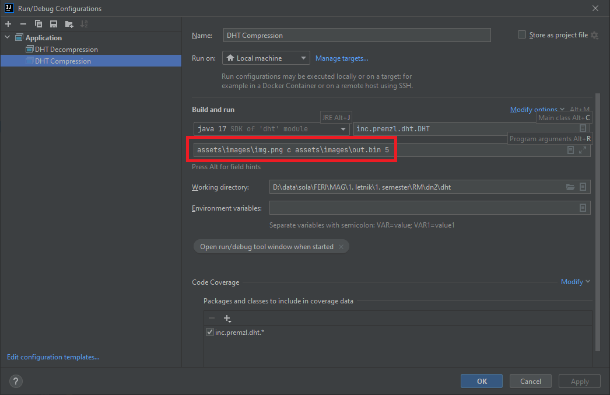

# Installation

## OpenCV

1. Download [the latest OpenCV](https://opencv.org/releases/) release
2. Add a dependency in the Project Structure
3. Add the .dll file

[Video reference](https://www.youtube.com/watch?v=vLf3ZcFotyA&ab_channel=Makeitnow)

## Usage

### Program arguments

**NOTE: Program behaves bad with low thresholds (example: 0 or 1), but compresses successfully and losses are not
significant (thr <= 10). With thr > 10, losses are visible.**

#### COMPRESSION

```
    <input image> c <output file> <thr>
    
    <input image> - path to the input image
                    (if in assets, example path will be assets\images\image.ext)
    c - option for compression
    <output file> - path to the output file
                    (if in assets, example path will be assets\images\out.bin)
    <thr> - threshold for compression
```

#### DECOMPRESSION

```
    <compressed binary> d <output image> <thr>
    
    <compressed binary> - path to the input binary 
                    (result of compression)
                    (if in assets, path will be assets\images\out.bin)
    c - option for compression
    <output image> - path to the output image
                    (if in assets, example path will be assets\images\out.bin)
    <thr> - threshold for compression
```

### Configuration

Using IntelliJ IDEA, create a new configuration:


